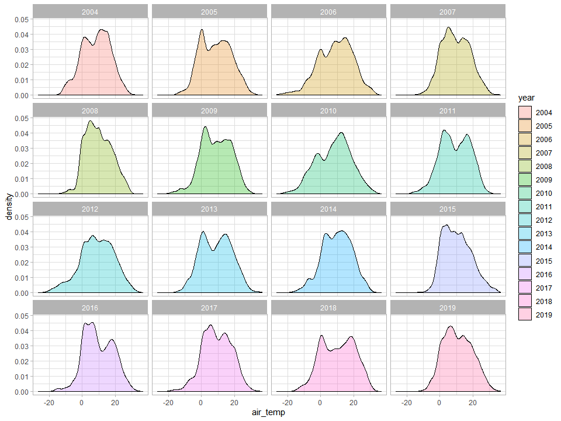
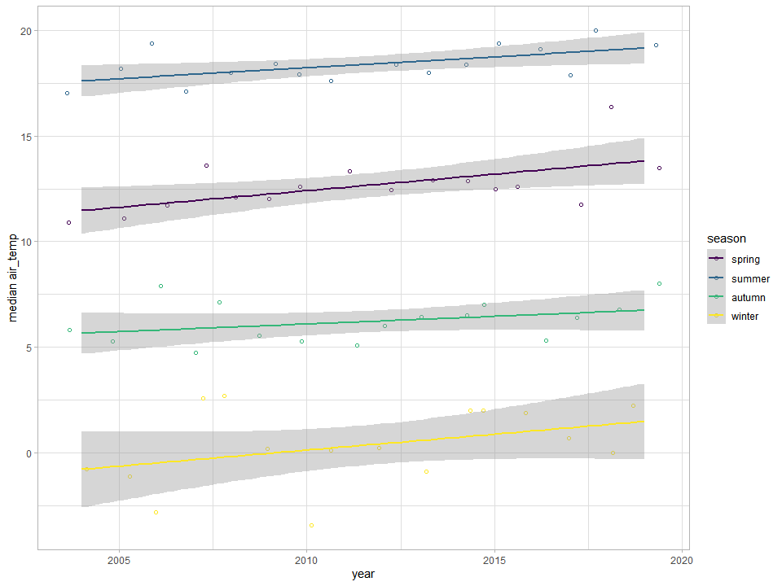
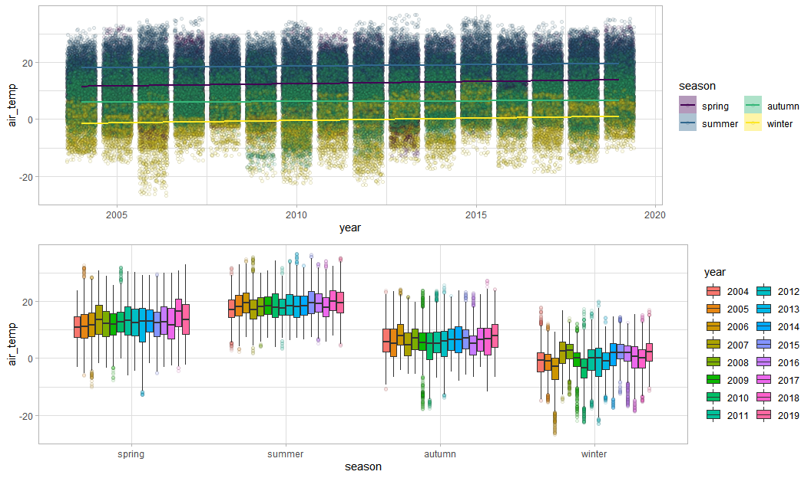

Temperature changes in Warsaw 2004-2019
================

Load data
=========

Data was downloaded manually from <https://dane.imgw.pl/> and I stored them in 'data-raw' folder.

    ## [1] 140256    107

The dataset contained over 140000 rows and 107 columns. Unfortunately tables did not contain column names, so I needed to enter them manually ( I will skip that ugly part).

This is all about temperature so let's select the right columns and translate them to english.

Explore data
============

Missing values
--------------

naniar package is nice for missing data visualisation.

And this is great as we have a complete dataset! Let's explore it further. \#\# Temperature values distribution  That's quite interesting. We see a bimodal distribution across most of the years (summer and winter? what about spring and autumn? do we still have 4 seasons?). 2012 looks like it had the most moderate temperatures as it is flat at the top. Anyway, let's split it by seasons. Let's assume that winter is 21-Dec - 20 Mar, spring 21-Mar - 20 Jun, summer 21-Jun - 20-Sep, Autumn 21-Sep - 20-Dec

 It looks like summer is the most stable season. There is a lot of variation in other seasons across the years. How it will look like when we split it by year:  Red vertical line inticates the median values per season of each year. It's difficult to see the trend on this. Lets try another way:  Yep, the median temperature of all the seasons generally increases in time. Here is the plot with full data for reference:  The way to check which season temperature is increasing faster is to compare betas (slopes angle) of linear model. Here are the betas for each season: 
